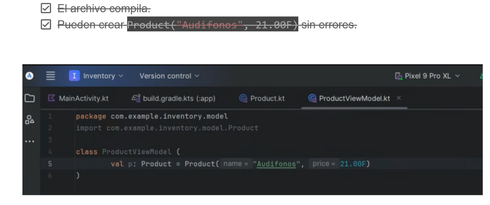
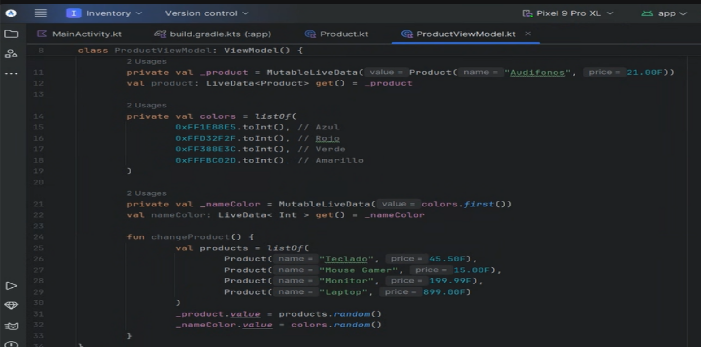
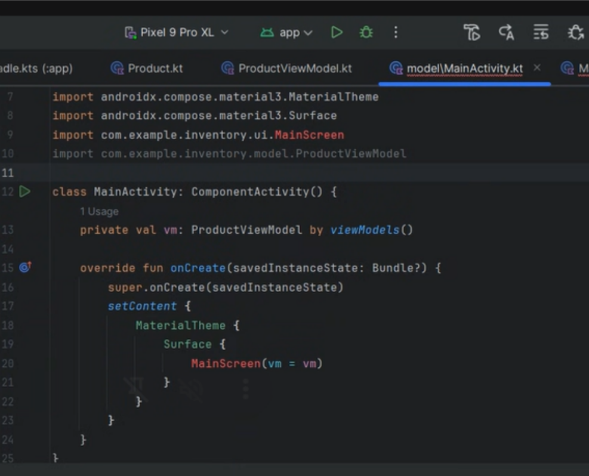
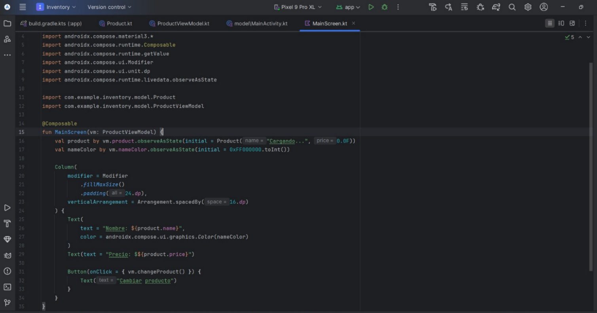
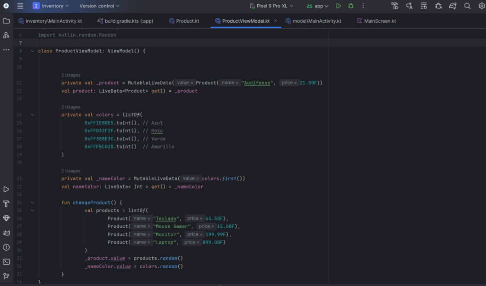
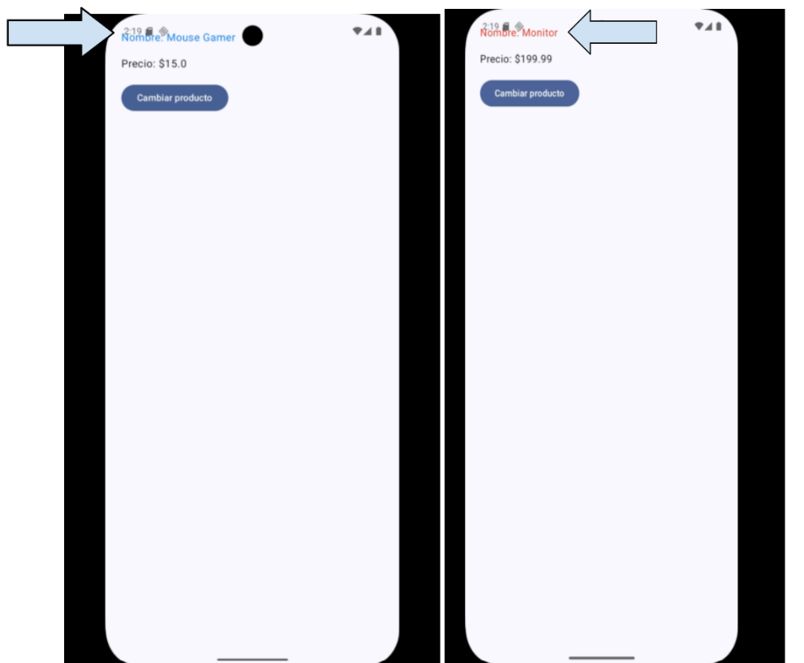

# README

## **Ejercicio**

### Objetivo
Construir una aplicación Android con Jetpack Compose aplicando el patrón de arquitectura MVVM (Model–View–ViewModel).
La aplicación debe:
- Mostrar un producto con nombre y precio.
- Cambiar el producto al presionar un botón.
- Observar el estado desde un ViewModel usando LiveData.
- Demostrar el uso de recomposición en Compose.

### Tecnología utilizada
- Lenguaje: Kotlin
- UI toolkit: Jetpack Compose
- Arquitectura: MVVM
- Observabilidad: LiveData
- IDE: Android Studio Ladybug | 2024.2.1
- SDK: minSdk 24, targetSdk 34

### Construcción paso a paso
**Hito 1 — Modelo**
Archivo: model/Product.kt
package com.example.inventory.model

data class Product(
    val name: String,
    val price: Float
)

**Hito 2 — ViewModel**  
Archivo: vm/ProductViewModel.kt
package com.example.inventory.vm

import androidx.lifecycle.LiveData
import androidx.lifecycle.MutableLiveData
import androidx.lifecycle.ViewModel
import com.example.inventory.model.Product

class ProductViewModel : ViewModel() {

    private val _product = MutableLiveData(Product("Audífonos", 21.99F))
    val product: LiveData<Product> get() = _product

    private val colors = listOf(
        0xFFE53935.toInt(), // rojo
        0xFF1E88E5.toInt(), // azul
        0xFF43A047.toInt(), // verde
        0xFFFDD835.toInt()  // amarillo
    )

    private val _nameColor = MutableLiveData(colors.first())
    val nameColor: LiveData<Int> get() = _nameColor

    fun changeProduct() {
        val products = listOf(
            Product("Laptop", 899.99F),
            Product("Mouse", 15.50F),
            Product("Teclado", 35.75F),
            Product("Monitor", 250.00F)
        )
        _product.value = products.random()
        _nameColor.value = colors.random()
    }
}

**Hito 3 — MainActivity y UI**  
Archivo: MainActivity.kt
class MainActivity : ComponentActivity() {

    private val vm: ProductViewModel by viewModels()

    override fun onCreate(savedInstanceState: Bundle?) {
        super.onCreate(savedInstanceState)
        setContent {
            MaterialTheme {
                Surface {
                    MainScreen(vm = vm)
                }
            }
        }
    }
}
Archivo: ui/MainScreen.kt
@Composable
fun MainScreen(vm: ProductViewModel) {
    val product = vm.product.observeAsState(Product("Cargando...", 0F)).value
    val nameColor = vm.nameColor.observeAsState().value ?: 0xFF000000.toInt()

    Column(
        modifier = Modifier
            .fillMaxSize()
            .padding(24.dp),
        verticalArrangement = Arrangement.spacedBy(16.dp)
    ) {
        Text(
            text = "Nombre: ${product.name}",
            color = Color(nameColor)
        )
        Text(text = "Precio: $${product.price}")

        Button(onClick = { vm.changeProduct() }) {
            Text("Cambiar producto")
        }
    }
}

**Hito 4 — Color dinámico**  

 El nombre cambia de color cada vez que presionamos el botón.
 texto en rojo, azul, verde, etc.

**Hito 5 — Documentación**
}  
Se agregó en este README cada hito con explicación + capturas.
En /docs/errores-comunes.md se incluyen los problemas frecuentes.
Errores comunes
Archivo: /docs/errores-comunes.md  

## **Descubrimiento: conceptos clave** 
### ¿Qué carpetas crea Android Studio y para qué sirven?

Cada proyecto de Android Studio incluye uno o más módulos con archivos de código fuente y archivos de recursos. Entre los tipos de módulos, se incluyen los siguientes:

- Módulos de apps para Android
- Módulos de biblioteca
- Módulos de Google App Engine

De manera predeterminada, Android Studio muestra los archivos del proyecto en la vista de proyecto de Android. Esta vista está organizada en módulos para poder acceder rápidamente a los archivos fuente clave del proyecto. Se pueden ver todos los archivos de compilación en el nivel superior, en Gradle Scripts.
Cada módulo de app contiene las siguientes carpetas:

- **manifests:** Contiene el archivo AndroidManifest.xml.
- **java:** Contiene los archivos de código fuente de Kotlin y Java, incluido el código de prueba JUnit.
- **res:** Contiene todos los recursos sin código, como cadenas de IU y, además, imágenes de mapa de bits.

### ¿Qué es Compose?
Jetpack Compose es un kit de herramientas moderno para crear IU nativas de Android. Jetpack Compose simplifica y acelera el desarrollo de IU en Android con menos código, herramientas potentes y API intuitivas de Kotlin.

### ¿Qué es el archivo build.gradle (Module) y cómo habilita Compose?
Es un archivo de configuración específico para cada módulo de tu proyecto Android que define:
- **Dependencias** del módulo
- **Plugins** necesarios
- **Versiones** de SDK y herramientas
- **Configuraciones** de compilación específicas

El archivo build.gradle (Module) habilita Jetpack Compose mediante los siguientes elementos de configuración:

1.	**Habilita el plugin de Kotlin** mediante la declaración id 'org.jetbrains.kotlin.android' en la sección de plugins, requisito fundamental para Compose.
2.	**Activa las funciones de Compose** con la directiva buildFeatures { compose true } dentro del bloque android, lo que permite el uso de componentes composables.
3.	**Configura la versión del compilador de Compose** mediante el bloque composeOptions { kotlinCompilerExtensionVersion 'x.x.x' }, asegurando compatibilidad con las librerías.
4.	**Define el nivel mínimo de API** con minSdk 24 (o superior) en defaultConfig, cumpliendo con el requisito mínimo de Android para Compose.
5.	**Especifica las dependencias necesarias** en la sección dependencies, incluyendo:
- androidx.activity:activity-compose para integrar Compose con Activities
- androidx.compose.ui:ui para los componentes base
- androidx.compose.material3:material3 para los componentes de Material Design
- androidx.compose.ui:ui-tooling-preview para herramientas de desarrollo.
6. **Configura las opciones de Kotlin** con kotlinOptions { jvmTarget = '1.8' }, requisito para el funcionamiento del compilador de Compose.
7.	**Habilita el uso de vectores** con vectorDrawables { useSupportLibrary true } para soportar iconos y gráficos vectoriales en Compose.
8.	**Incluye dependencias de testing** específicas para Compose como androidx.compose.ui:ui-test-junit4 y androidx.compose.ui:ui-tooling para pruebas y depuración.
9.	**Utiliza el BOM de Compose** (Bill of Materials) con platform('androidx.compose:compose-bom:xxx') para gestionar automáticamente las versiones compatibles de todas las dependencias de Compose.
10.	**Configura las opciones de compilación** con compileOptions estableciendo compatibilidad con Java 8, requerimiento para las features modernas de Kotlin utilizadas por Compose.

### ¿Qué es la arquitectura MVVM?
El patrón MVVM (Model-View-ViewModel) es un patrón arquitectónico creado para separar y organizar el código en aplicaciones de interfaz de usuario (UI). Fue propuesto por primera vez por Microsoft como una derivación del patrón MVC (Model-View-Controller) y del MVP (Model-View-Presenter).

MVVM se centra en facilitar la separación de problemas y fomentar la reutilización de código, facilitando la prueba unitaria y la mantenibilidad del mismo. Esta separación se logra a través de tres componentes principales: Model, View y ViewModel.

El Model representa la lógica de negocio y los datos. La View es responsable de la presentación de los datos, y el ViewModel actúa como un intermediario que mantiene la lógica de UI y maneja la sincronización de datos entre el Model y la View. Esta estructura permite que cada componente se pueda desarrollar, probar y mantener de manera independiente, fomentando un diseño claro y organizado.

### ¿Qué es ViewModel?
La clase ViewModel es una lógica empresarial o un contenedor de estado a nivel de pantalla. Expone el estado a la IU y encapsula la lógica empresarial relacionada. Su principal ventaja es que almacena en caché el estado y lo conserva durante los cambios de configuración. Esto significa que la IU no tiene que recuperar datos cuando navegas entre actividades o si sigues cambios de configuración, como cuando rotas la pantalla.

### ¿Qué es LiveData?
LiveData es una clase de contenedor de datos observable. A diferencia de un observable regular, LiveData está optimizado para ciclos de vida, lo que significa que respeta el ciclo de vida de otros componentes de las apps, como actividades, fragmentos o servicios. Esta optimización garantiza que LiveData solo actualice observadores de componentes de apps que tienen un estado de ciclo de vida activo.

LiveData considera que un observador, que está representado por la clase Observer, está en estado activo si su ciclo de vida está en el estado STARTED o RESUMED. LiveData solo notifica a los observadores activos sobre las actualizaciones. Los observadores inactivos registrados para ver objetos LiveData no reciben notificaciones sobre los cambios.
Puedes registrar un observador vinculado con un objeto que implemente la interfaz LifecycleOwner. Esta relación permite quitar al observador cuando el estado del objeto Lifecycle correspondiente cambia a DESTROYED. Esto es especialmente útil para actividades y fragmentos, ya que pueden observar objetos LiveData de forma segura y no preocuparse por las filtraciones: las actividades y los fragmentos se anulan instantáneamente cuando se destruyen sus ciclos de vida.

### ¿Qué librerías se necesitan para trabajar con ViewModel y LiveData dentro de Compose?
Para trabajar con ViewModel y LiveData en Jetpack Compose, necesitas las siguientes librerías:
dependencies 
{
    // ViewModel para Compose
    implementation "androidx.lifecycle:lifecycle-viewmodel-compose:2.7.0"
    
    // LiveData para Compose
    implementation "androidx.compose.runtime:runtime-livedata:1.6.4"
    
    // ViewModel (core)
    implementation "androidx.lifecycle:lifecycle-viewmodel-ktx:2.7.0"
    
    // LiveData (core)
    implementation "androidx.lifecycle:lifecycle-livedata-ktx:2.7.0"
    
    // Runtime de Lifecycle
    implementation "androidx.lifecycle:lifecycle-runtime-ktx:2.7.0"
    
    // Dependencias básicas de Compose (ya deberías tenerlas)
    implementation 'androidx.activity:activity-compose:1.8.2'
    implementation platform('androidx.compose:compose-bom:2023.08.00')
    implementation 'androidx.compose.ui:ui'
    implementation 'androidx.compose.ui:ui-graphics'
    implementation 'androidx.compose.ui:ui-tooling-preview'
    implementation 'androidx.compose.material3:material3'
}

